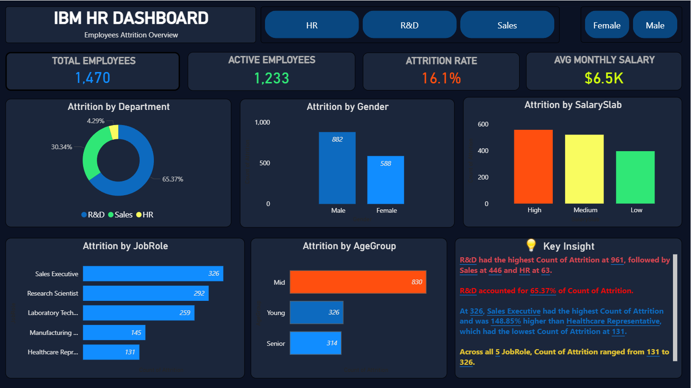

# 👥 HR Analytics Dashboard (Employee Attrition Analysis)

<div align="center">
  
</div>

---

## 📊 Project Overview
This project focuses on analyzing employee attrition patterns using the **IBM HR Analytics Dataset**. By processing records for **1,470 employees**, I identified the primary factors driving employee turnover and created an interactive dashboard to help HR teams make data-driven retention strategies.

### 🎯 Key Objectives:
* Calculate the overall Attrition Rate and identify high-risk departments.
* Analyze the impact of Overtime, Salary, and Tenure on employee exits.
* Visualize employee demographics (Age, Gender, Education) related to turnover.
* Provide data-backed recommendations to improve employee retention.

---

## 🛠️ Tech Stack & Skills
* **Visualization:** Power BI (Interactive Dashboarding)
* **Data Transformation:** Power Query (Data Cleaning & ETL)
* **Analytical Calculations:** DAX (8+ Custom Measures)
* **Analysis Tool:** Microsoft Excel (Pivot Tables for Cross-Analysis)

---

## 📈 Dashboard Preview


> *Note: Ensure the image file `hr-dasboard-image.PNG` is uploaded to your GitHub repository.*

---

## 🚀 Key Insights (Attrition Analysis)
| Metric | Value |
|---|---|
| 📉 Overall Attrition Rate | 16.1% (237 out of 1,470 employees) |
| ⏱️ Top Driver | Overtime — 53.6% of exits |
| 💸 Salary Impact | 68.8% exits from Low Salary bracket (<$5k/month) |
| 🏢 Department at Risk | Sales — 20.6% attrition rate |
| 💍 Marital Status | Single employees — 50.6% of total exits |
| 📅 Avg Tenure | Only 5.1 years for employees who left |

---

## 🧪 DAX Measures Used
I created several custom measures to power the dashboard visuals, including:

* **Attrition Rate:** `(Count of Attrition / Total Employees) * 100`
* **Active Employees:** Total staff excluding those who left.
* **Average Salary Analysis:** Comparing income levels of stayed vs. left employees.

---

## 📂 Project Structure

```
├── 📊 hr_dashboard.pbix                  # Power BI Dashboard File
├── 📄 hr-employee-attrition-data.csv     # Raw Dataset
├── 📝 hr_analytics_report.pdf            # Detailed Summary & Findings
└── 📝 README.md                          # Project Documentation
                    
``` 
---

## 💡 Recommendations
* **Policy Reform:** Audit overtime distribution to reduce burnout — overtime is the #1 attrition driver.
* **Compensation:** Conduct salary benchmarking for 'Low Income' roles (specifically Lab Technicians and Sales Reps).
* **Engagement:** Introduce social engagement and mentorship programs for 'Single' and 'Early-Tenure' employees.
* **Targeted Growth:** Define clearer career paths for the Sales department to lower their 20.6% churn rate.

---

## 👤 Author

**Anuj Kumar Tiwari** — Aspiring Data Analyst

<p align="center">
  <a href="https://linkedin.com/in/anuj-kumar-tiwari-107704208">
    
  </a>
  <a href="mailto:anuujji@gmail.com">
    
  </a>
  <a href="https://github.com/Anuj-Kumar-Tiwari">
    
  </a>
</p>

---

<p align="center">
  ⭐ <b>If you find this analysis insightful, feel free to star the repository!</b>
</p>
